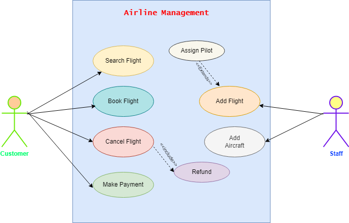
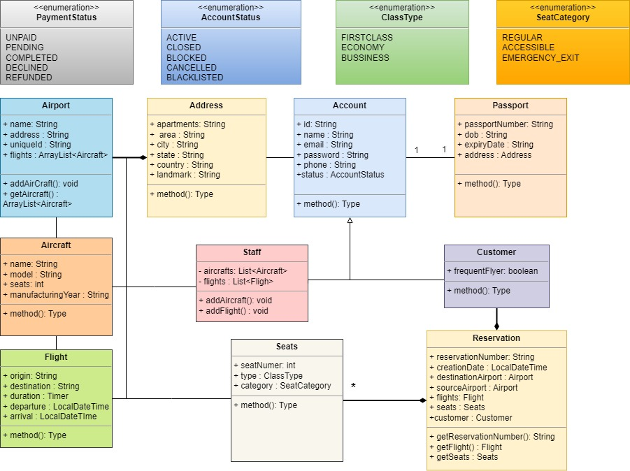

# Airline Booking System

## 5 Steps of Object Oriented Analysis and Design

1. Gather all requirements.
2. Create Use- Case Diagram
3. Create Class Diagram
4. Create Skelton Code
5. Comple Code Implementation

## 1. Requirements

1. Customers should be able to search for flight
2. Customers should be able to reserve a ticket for any scheduled flight.
3. Users of the system can check flight schedules, their departure tume, available seats, arrival time, and other flight details.
4. Only the staff of the system can add new aircrafts, flights.

### Assumptions

1. The customers should be able to handle payments for reservations.
2. Customers can cancel thier reservation and itinerary.
3. Customers must have a passport to travel. 
4. All the Aircrafts and flights will be managed by airport

## 2. Create Use Diagram

### a. Identify actors

1. Customers
2. Staff

### b. Identify the use cases

Customer can —→ Search Flight, Book Flight, Cancel Flight, make payement

Staff can ————> Add Flight, Add Aircraft

**Adding Inclusive Use cases**

If Customer cancel flight Refund must be inititated

**Adding Extension Use Cases**

Assign pilot when flight is added.

## 3. Class Diagram

Mark the Nouns for classes

- Noun Definition
    
    A noun is a part of speech that represents a person, place, thing, or idea. It is a word that can be the subject or object of a sentence, and it plays a central role in the structure of sentences. Nouns can be concrete or abstract.
    
    Here are a few examples:
    
    1. **Person:** teacher, student, doctor
    2. **Place:** city, park, school
    3. **Thing:** book, table, car
    4. **Idea:** love, freedom, happiness
    
    In a sentence, a noun can function as the subject (the one performing the action) or the object (the one receiving the action). For example:
    
    - **Subject:** *The cat* is on the roof.
    - **Object:** I saw *a movie* yesterday.
    
    Nouns are essential building blocks of language, and they are used to name and identify people, places, things, and concepts in our everyday communication.
    
- Customer
- Flight
- Seats
- Staff
- Aircraft
- Reservation
- Passport
- Airport
- Address
- Account

Enumerations

- Seat Category
- Payment Status
- Class type
- Reference
    
    