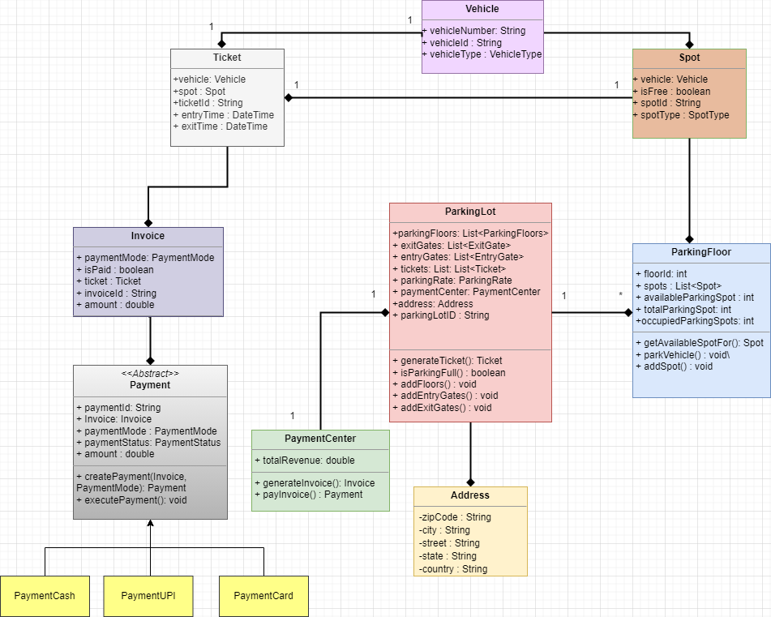

## **Objective**:

Design the low-level architecture for a backend system of a smart parking lot. This system should handle vehicle entry and exit management, parking space allocation, and fee calculation.

## **Problem Statement**:

Imagine a parking lot in an urban area with multiple floors and numerous parking spots. Your task is to create a low-level design for a system that efficiently manages the parking process. The system should automatically assign parking spots based on vehicle size and availability, track the time each vehicle spends in the parking lot, and calculate parking fees upon exit.

## System Requirements

1. The parking lot system have multiple floors where customer can park there vehicle.
2. Multiple Entry and Exit points.
3. Customers can collect a parking ticket from the entry point and can pay the ticket at exit time.
4. The system should support a per-hour parking fee model and spot type.
5. System should be able to calculate total revenue at any time.
6. Customer can pay via cash or Card.
7. The system should not allow more vehicles if the Parking is Full.
8. Each Floor should have multiple spot of Various Sizes: COMPACT, STANDARD, LARGE, MOTORBIKE, ELECTRIC, DISABLED.
9. The Parking spot should support diffectrent types of Vehicles: COMPACT, SEDAN, SUV, MOTORBIKE, TRUCK, BUS.
10. The system should allocate parking spot to vehile.

## UML Diagram

